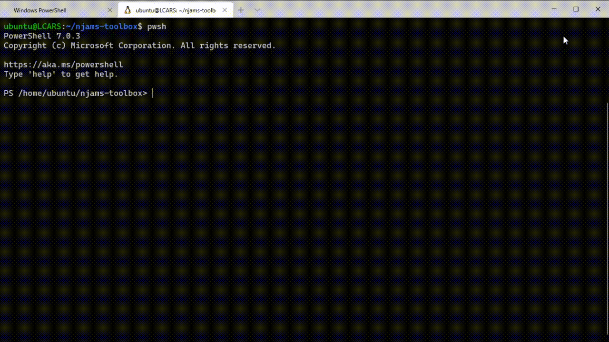

# setLogLevel.ps1
Set log level for domain objects with regards to a given domain object path of an nJAMS instance.

## Description:

This script changes the log level of domain objects related to a specified domain object path including its sub elements. The log level can be set to INFO, SUCCESS, WARNING, or ERROR.

The script requires to enter the URL of an nJAMS Server instance, including username and password, the domain object path that contains the domain objects that should be applied with new log level, and the new log level. 

The script can be executed on any Windows, Linux, or Mac machine within the same network of the machine, where nJAMS Server is running.

## Characteristics:

* allows to change log level for a bunch of domain objects
* allows RegEx in filter criterion to limit domain object selection of domain object path
* parameter "list" allows to only list domain objects without changing the log level.
* supports nJAMS Server instances 4.4, 5.0, and 5.1 using HTTP or TLS/HTTPS.
* script runs on Windows, Linux, and macOS using PowerShell Core 7 or Windows PowerShell 5
* output can be formatted individually by common PowerShell `format` cmdlet

## Demo - how to set the log level to "ERROR" for a specific domain objects:


## Usage:

```
SYNTAX
    ./setLogLevel.ps1 [-instance] <String> 
                      [-username] <String> [-password] <String> 
                      [-domainObjectPath] <String> 
                      [[-domainObjectFilter] <String>] 
                      [-domainObjectLogLevel] <String> 
                      [-list] 
                      [<CommonParameters>]
```

Run `./setLogLevel.ps1 -?` to learn more about how to use the script. 

## Execution:

* Linux/Unix:

  Run a shell and enter command, for example:

  ```
  $ pwsh -c './setLogLevel.ps1 -instance "http://localhost:8080/njams" -path ">prod>finance>invoicing>" -loglevel "ERROR"'
  ```

* Windows:

  Run PowerShell and enter command, for example:

  ```
  PS C:\> .\setLogLevel.ps1 -instance "http://localhost:8080/njams" -path ">prod>finance>invoicing>" -loglevel "ERROR"
  ```

* macOS:

  Run a shell and enter command, for example:

  ```
  $ pwsh -c './setLogLevel.ps1 -instance "http://localhost:8080/njams" -path ">prod>finance>invoicing>" -loglevel "ERROR"'
  ```

## Prerequisites:

* Linux/Unix: 

  This script requires *PowerShell 7* or higher. Please follow these instructions to install PowerShell 7 on Linux/Unix:
  https://docs.microsoft.com/en-us/powershell/scripting/install/installing-powershell-core-on-linux?view=powershell-7

* Windows:

  This script requires *Windows PowerShell 5*, respectively *PowerShell 7* or higher. Please follow these instructions to install PowerShell 7 on Linux/Unix:
  https://docs.microsoft.com/en-us/powershell/scripting/install/installing-powershell-core-on-windows?view=powershell-7

* macOS:

  This script requires *PowerShell 7* or higher. Please follow these instructions to install PowerShell 7 on macOS:
  https://docs.microsoft.com/en-us/powershell/scripting/install/installing-powershell-core-on-macos?view=powershell-7